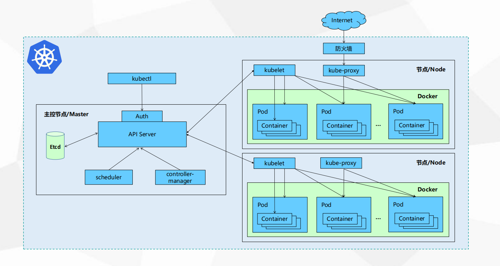

[TOC]


## 模块关系



## 目录树

```bash
kubernetes{
	pkg{

	}
	# 各个模块的启动代码
	cmd{
		kubectl
		kube-apiserver
	}
	# 貌似vendor目录包发布前的目录
	staging{

	}

	vendor{
	}
}

```


## kubectl

- 使用 cobra 使用命令行
- 请求的 kube-apiserver 的接口
- Builders, Visitors
- https://topsli.github.io/2018/12/23/kubernetes_source_kubectl.html

```go
/*
    entry: cmd/kubectl/kubectl.go
           vendor/k8s.io/kubectl/pkg/cmd/cmd.go

*/ 

// Builders, Visitors, vendor/k8s.io/cli-runtime/pkg/resource/


// create, vendor/k8s.io/kubectl/pkg/cmd/create/create.go

```

## kube-apiserver


### 启动过程

- 资源注册


### 资源注册

- 将k8s所支持的资源注册到Scheme资源注册表中
```go 
import "k8s.io/kubernetes/pkg/api/legacyscheme" // 通过 import 来注册资源
```


### 3种http服务

- KubeAPIServer
	- 核心服务，提供k8s内置核心资源服务，不允许开发者随意修改，如：Pod，Service等
	- Master
	- Legacyscheme.Scheme
- APIExtensionsServer
	- API扩展服务，该服务提供了CRD自定义资源服务
	- CustomResourceDefinitions
	- 

```go
/*
启动过程
cmd/kube-apiserver/apiserver.go
*/


```


- https://cloud.tencent.com/developer/article/1533221?from=article.detail.1717404
- https://www.cnblogs.com/daniel-hutao/p/9939233.html


## kube-scheduler

- scheduler作为一个客户端，从apiserver中读取到需要分配的pod，和拥有的node，
- 过滤(调度器先过滤掉不满足 pod 运行条件的节点，这个过程是 Predicate)
- 算分(Priorities)
- 最后把这个匹配信息通过apiserver写入到etcd里面，供下一步的kubelet去拉起pod使用
- https://www.cnblogs.com/wanpi/p/14705821.html


## kube-controller-manager

- kubernetes/pkg/controller
- 通用编排方式, 循环控制